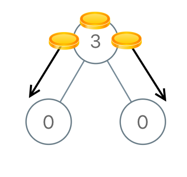
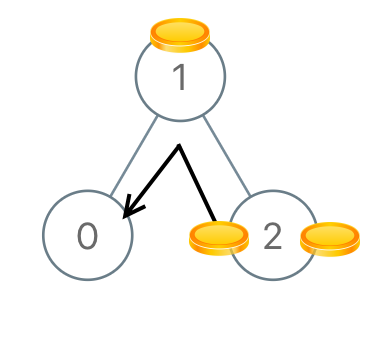

# 979. Distribute Coins in Binary Tree
https://leetcode.com/problems/distribute-coins-in-binary-tree/

# Description
Given the `root` of a binary tree with `N` nodes, each `node` in the tree has `node.val` coins, and there are N coins total.  
In one move, we may choose two adjacent nodes and move one coin from one node to another.  (The move may be from parent to child, or from child to parent.)  
Return the number of moves required to make every node have exactly one coin.

# Example
## Example 1


**Input**: [3,0,0]

**Output**: 2

**Explanation**:  
From the root of the tree, we move one coin to its left child, and one coin to its right child.

## Example 2


**Input**: [0,3,0]

**Output**: 3

**Explanation**:  
From the left child of the root, we move two coins to the root [taking two moves].  Then, we move one coin from the root of the tree to the right child.

## Example 3


**Input**: [1,0,2]

**Output**: 2

## Example 4


**Input**: [1,0,0,null,3]

**Output**: 4

# Limitation
- 1 <= `N` <= 100
- 0 <= `node.val` <= `N`

# Solution 1
## Explanation
每個 `node` 都只需留一枚硬幣，令 `n` 為某 `node` 所拿到的硬幣數量 (自己與左右子樹的)，則該 `node` 會造成 `abs(n-1)` 個硬幣移動。  
又，令 `n - 1` 為該 `node` 多餘或缺少的硬幣數量，可得知：
- 若 `n - 1` > 0，表示該 `node` 擁有超過 1 枚硬幣，多的可以往 parent 傳送，同時會造成 `n - 1` 枚硬幣移動
- 若 `n - 1` < 0，表示該 `node` 不足 1 枚硬幣，缺少的數量必需由某個 node 傳過來，所以會造成 `abs(n - 1)` 枚硬幣移動

由上可知，只要累加每個 `node` 的 `abs(n-1)` 便是答案。

## Source Code
```python
class Solution:
    def distributeCoins(self, root: TreeNode) -> int:
        def dfs(node):
            if node is None:
                return 0, 0
            left_n, left_balance = dfs(node.left)
            right_n, right_balance = dfs(node.right)
            n = (node.val + left_balance + right_balance)
            return (left_n + right_n + abs(n-1)), n-1
        res, _ = dfs(root)
        return res
```

## Analysis
- Time: `O(node)`
- Space: `O(maxTreeLevel)`
